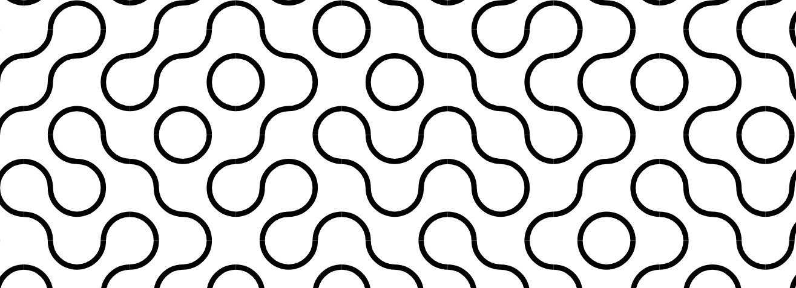

# Project 1: Plotting Tiles

    

In this project, you will be creating a set of artistic tiles using a pen plotter. This can be any kind of tile, and can be produced with any mixture of methods you prefer so long as the final piece is significantly programmatically generated.

In this project, you are tasked with the creation of a unique piece of art, employing a pen plotter as your medium. Your goal is to programmatically produce an aesthetically-pleasing set of tiles using your own SVG toolbox library and then fabricate them using a pen plotter. These can be any kind of tile, and can be designed with any mixture of methods you prefer so long as they are significantly programmatically generated.

Your tiles should belong together and form a cohesive set. They should share some commonality that ties them together and produces a holistic gestalt perception of the whole piece. They should work well in any arrangement.

### Project Steps:

1. **Research and Inspiration:**
   - Begin by researching various tile patterns, with a particular focus on Truchet tiles as a notable example. Explore the principles behind different tile designs, such as symmetry, tessellation, and the use of negative space, to gather inspiration for your own set of tiles. Consider how different patterns can convey movement, depth, and visual interest.

2. **Programmatic Design:**
   - Design a program that generates an SVG file representing your tile pattern(s). You should the SVG Toolbox library you have been working on.
   - Your program should be flexible, accepting parameters that influence the size, color, and shape of the tiles. While graphical tools can assist in refining your designs, the primary design work should be accomplished through your program, showcasing your ability to translate conceptual ideas into programmable patterns.

3. **CNC Fabrication:**
   - Use a CNC machine to materialize your designs. Although the use of a pen plotter is preferred for its unique artistic qualities, you are welcome to employ other CNC technologies such as laser cutters, vinyl cutters, or even 3D printers modified with a pen attachment. This step will likely involve experimentation and iterative adjustments to achieve the desired aesthetic and precision in your tile set.

4. **Reflective Analysis:**
   - After completing your project, reflect on the process from concept to fabrication. Discuss the creative and technical challenges you encountered, as well as any unexpected successes. This reflection is crucial for deepening your understanding of the potential and limitations of CNC technology in artistic applications.

### Objectives:

This project aims to:
- Introduce you to the creative possibilities offered by CNC machinery in art.
- Encourage an exploration of geometric patterns and their aesthetic and symbolic potential.
- Provide practical experience in translating digital designs into physical artifacts using CNC technology.
- Foster critical thinking about the integration of technology, design, and art.

### Submission Requirements:

For project submission, please include:
- The final SVG file(s) generated by your program. These should be plottable on a pen plotter (or whatever machine you choose to use).
- Documentation of your program, detailing how to run it, the design choices made, and any parameters that can be adjusted.
- The fabricated tiles themselves, either fabricated separately or plotted together into a single piece (these will be shown in critique).
- Your reflections, as discussed above.
